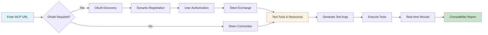

# 🚀 MCP Eval - The Ultimate MCP Server Testing Tool

<div align="center">

[](https://www.mcpevals.ai)
[](https://github.com/scorecard-ai/mcp-eval/stargazers)
[](https://discord.gg/keUXXXdR)

**Test MCP servers instantly with OAuth support and intelligent test generation**

</div>

## 🎯 What is MCP Eval?

MCP Eval is the first comprehensive testing platform for Model Context Protocol (MCP) servers. Whether you're building an MCP server or integrating with one, MCP Eval gives you instant insights into server capabilities, performance, and compatibility.

### 🔍 Instant Compatibility Check

MCP Eval automatically verifies your server's compatibility with:
- ✅ **ChatGPT** - Ensure your MCP server works with OpenAI's ChatGPT
- ✅ **Claude** - Full compatibility testing for Anthropic's Claude
- ✅ **Cursor** - Validate integration with Cursor IDE

## ✨ Why MCP Eval?

### 🔥 Features That Make Us Different

| Feature | MCP Eval | MCP Inspector | Manual Testing |
|---------|----------|---------------|----------------|
| **OAuth Support** | ✅ Full OAuth 2.0 | ❌ Not supported | ❌ Manual tokens |
| **Intelligent Testing** | ✅ Auto-generates test args | ❌ Empty args only | ❌ Manual input |
| **Real-time Streaming** | ✅ Live progress updates | ⚠️ Limited | ❌ Wait for results |
| **Tool Discovery** | ✅ Tests all tools | ✅ Shows tools | ❌ One at a time |
| **Performance Metrics** | ✅ Response times | ❌ No metrics | ❌ Not measured |
| **One-Click Testing** | ✅ Just paste URL | ⚠️ CLI required | ❌ Complex setup |

## Quick Start

### Web App

Visit [mcpevals.ai](https://www.mcpevals.ai) → Paste MCP URL → Click "Evaluate"

### Self-Host

```bash
git clone https://github.com/scorecard-ai/mcp-eval.git
cd mcp-eval/mcp-eval-site
npm install
npm run dev
```

Set environment variables in `.env.local`:
```
NEXT_PUBLIC_APP_URL=http://localhost:3000
OPENAI_API_KEY=your-key-here
```

## How It Works



1. **Enter MCP Server URL** - Supports both public and OAuth-protected servers
2. **Automatic OAuth Flow** - Handles discovery, registration, and authorization
3. **Intelligent Testing** - Generates appropriate test data for each tool
4. **Real-time Results** - See tests run live with detailed feedback
5. **Compatibility Report** - Get instant confirmation of ChatGPT, Claude, and Cursor support

## Example Test Generation

```javascript
// Tool: search_users
// Generated arguments:
{ "query": "test search", "limit": 10 }

// Tool: create_task
// Generated arguments:
{ "title": "Test Task", "priority": "medium" }
```

## Tech Stack

- Next.js 15 with App Router
- TypeScript
- MCP SDK
- Server-Sent Events for streaming

## 🐛 Found a Bug?

Report issues at [github.com/scorecard-ai/mcp-eval/issues](https://github.com/scorecard-ai/mcp-eval/issues)

## Contributing

PRs welcome! See [CONTRIBUTING.md](CONTRIBUTING.md) for guidelines.

## Powered by Scorecard

Built by [Scorecard AI](https://scorecard.io), the leading platform for AI evaluation and testing.

## License

MIT © [Scorecard AI](https://scorecard.io)

---

<div align="center">

[Website](https://www.mcpevals.ai) • [Discord](https://discord.gg/keUXXXdR) • [GitHub](https://github.com/scorecard-ai/mcp-eval)

</div>