# 🚀 MCP Eval - The Ultimate MCP Server Testing Tool

<div align="center">


[](https://www.mcpevals.ai)
[](https://github.com/scorecard-ai/mcp-eval/stargazers)
[](LICENSE)
[](https://twitter.com/intent/tweet?text=Check%20out%20MCP%20Eval%20-%20The%20ultimate%20tool%20for%20testing%20MCP%20servers!%20%F0%9F%9A%80&url=https://github.com/scorecard-ai/mcp-eval)

**Test Any MCP Server in Seconds • OAuth Support • Real-time Results • Intelligent Test Generation**

[🌐 Try it Now](https://www.mcpevals.ai) • [📖 Documentation](#documentation) • [🤝 Contributing](#contributing) • [🐛 Report Bug](https://github.com/scorecard-ai/mcp-eval/issues)

</div>

---

## 🎯 What is MCP Eval?

**MCP Eval** is the **first comprehensive testing platform** for Model Context Protocol (MCP) servers. Whether you're building an MCP server or integrating with one, MCP Eval gives you instant insights into server capabilities, performance, and compatibility.

### ✨ Why MCP Eval?

```mermaid
graph LR
    A[🔗 Enter MCP URL] --> B[🔐 OAuth Auth]
    B --> C[🧪 Smart Testing]
    C --> D[📊 Instant Results]
    D --> E[🎉 Ship with Confidence]
```



## 🔥 Features That Make Us Different

| Feature | MCP Eval | Manual Testing | Other Tools |
|---------|----------|----------------|-------------|
| **OAuth Support** | ✅ Full OAuth 2.0 | ❌ Manual tokens | ❌ Not supported |
| **Intelligent Testing** | ✅ Auto-generates test args | ❌ Manual input | ❌ Empty args only |
| **Real-time Streaming** | ✅ Live progress updates | ❌ Wait for results | ❌ Static output |
| **Tool Discovery** | ✅ Tests all tools | ❌ One at a time | ⚠️ Limited |
| **Performance Metrics** | ✅ Response times | ❌ Not measured | ❌ No metrics |
| **One-Click Testing** | ✅ Just paste URL | ❌ Complex setup | ❌ CLI required |

## 🚀 Quick Start

### 🌐 Web App (Easiest)

1. **Visit** [mcpevals.ai](https://www.mcpevals.ai)
2. **Paste** your MCP server URL
3. **Click** "Auto Eval"
4. **Get** instant results!

### 💻 Self-Host

```bash
# Clone the repo
git clone https://github.com/scorecard-ai/mcp-eval.git
cd mcp-eval/mcp-eval-site

# Install dependencies
npm install

# Set environment variables
echo "NEXT_PUBLIC_APP_URL=http://localhost:3000" > .env.local
echo "OPENAI_API_KEY=your-key-here" >> .env.local

# Run development server
npm run dev

# Open http://localhost:3000
```

## 🎬 See It In Action

### Testing an OAuth-Protected MCP Server
```
1. Enter URL: https://mcp.scorecard.io/mcp
2. Click "Auto Eval"
3. OAuth popup appears → Authorize
4. Watch real-time test results stream in!
```

**Results you'll see:**
- ✅ **Authentication Status** - OAuth flow completed
- ✅ **Tool Discovery** - Found 24 tools with schemas
- ✅ **Intelligent Testing** - Each tool tested with smart arguments
- ✅ **Performance Metrics** - Response times for each operation
- ✅ **Resource Discovery** - Available resources and capabilities

## 🧠 How It Works

### Intelligent Test Generation

MCP Eval doesn't just call tools with empty arguments. It **intelligently generates test data** based on:

1. **Schema Analysis** - Reads tool input schemas
2. **Semantic Understanding** - Interprets parameter names
3. **Type-Aware Generation** - Creates appropriate data types

**Example:**
```javascript
// Tool: create_task
// MCP Eval generates:
{
  "title": "Test Task",
  "description": "A test task created by MCP Eval",
  "priority": "medium",
  "due_date": "2025-12-31"
}

// Tool: search_users
// MCP Eval generates:
{
  "query": "test search",
  "limit": 10,
  "offset": 0
}
```

## 🔐 OAuth Support

First-class OAuth 2.0 support with:
- 🔍 Automatic discovery via `.well-known` endpoints
- 📝 Dynamic client registration
- 🔑 PKCE flow for enhanced security
- 🔄 Token exchange and refresh
- 🎯 Seamless redirect handling

## 📊 Comprehensive Testing

Each MCP server is tested across multiple dimensions:

```
┌─────────────────────────────────────┐
│        MCP Server Evaluation        │
├─────────────────────────────────────┤
│ ✅ Connection Test                  │
│ ✅ Authentication (if required)     │
│ ✅ Tool Discovery                   │
│ ✅ Tool Execution (5+ tools)       │
│ ✅ Resource Discovery               │
│ ✅ Performance Benchmarking         │
└─────────────────────────────────────┘
```

## 🛠️ Built With

- **[Next.js 15](https://nextjs.org/)** - React framework with App Router
- **[MCP SDK](https://modelcontextprotocol.io/)** - Official MCP TypeScript SDK
- **[TypeScript](https://www.typescriptlang.org/)** - Type safety
- **[Tailwind CSS](https://tailwindcss.com/)** - Styling
- **[Server-Sent Events](https://developer.mozilla.org/en-US/docs/Web/API/Server-sent_events)** - Real-time streaming

## 🤝 Contributing

We love contributions! See [CONTRIBUTING.md](CONTRIBUTING.md) for guidelines.

### Quick Contribution Guide

1. Fork the repo
2. Create your feature branch (`git checkout -b feature/AmazingFeature`)
3. Commit your changes (`git commit -m 'Add some AmazingFeature'`)
4. Push to the branch (`git push origin feature/AmazingFeature`)
5. Open a Pull Request

## 📈 Roadmap

- [ ] **Scoring System** - Rate servers 0-100
- [ ] **Export Results** - JSON, CSV, PDF reports
- [ ] **Test History** - Track server changes over time
- [ ] **Custom Test Suites** - Define your own test scenarios
- [ ] **Performance Graphs** - Visualize response times
- [ ] **Batch Testing** - Test multiple servers at once
- [ ] **CI/CD Integration** - GitHub Actions, Jenkins plugins
- [ ] **Prompt Testing** - Test MCP prompts and templates

## 🌟 Success Stories

> "MCP Eval helped us identify and fix 3 critical issues in our MCP server before launch" - *Engineering Team at TechCorp*

> "The OAuth support is a game-changer. No more manual token management!" - *DevOps Engineer*

> "We use MCP Eval in our CI pipeline to ensure our MCP server never breaks" - *Platform Team*

## 📜 License

MIT © [Scorecard AI](https://scorecard.ai)

## 🏆 Powered by Scorecard

<div align="center">
  <a href="https://scorecard.ai">
    
  </a>
</div>

**[Scorecard AI](https://scorecard.ai)** is the leading platform for AI evaluation and testing. We built MCP Eval to help developers confidently ship MCP servers to production.

### Why Scorecard?

- 🎯 **Expert in AI Testing** - We test AI systems at scale every day
- 🔬 **Research-Driven** - Our evaluation methods are based on cutting-edge research
- 🚀 **Production-Ready** - Used by Fortune 500 companies to test their AI infrastructure
- 🤝 **Open Source First** - We believe in giving back to the community

**Want enterprise-grade MCP testing?** [Contact Scorecard AI](https://scorecard.ai/contact) for custom evaluation suites, SLAs, and dedicated support.

## 🙏 Acknowledgments

- The [Anthropic](https://www.anthropic.com/) team for creating MCP
- All contributors who have helped improve MCP Eval
- The open-source community for inspiration and support

---

<div align="center">

**Built with ❤️ by the [Scorecard AI](https://scorecard.ai) team**

⭐ **Star us on GitHub** to support the project!

[Website](https://www.mcpevals.ai) • [Twitter](https://twitter.com/scorecard_ai) • [Discord](https://discord.gg/keUXXXdR) • [Scorecard AI](https://scorecard.ai)

</div>

---

## 🎨 Image Generation Prompt for Gemini

**Hero Image Prompt:**
```
Create a futuristic, vibrant hero image for MCP Eval, a web-based testing tool for MCP servers.

Visual elements to include:
- A sleek, modern dashboard interface floating in 3D space
- Glowing connection lines between multiple server nodes
- Green checkmarks and test results streaming in real-time
- OAuth lock icons transforming into unlocked states with golden light
- A rocket ship launching from a computer screen symbolizing deployment
- Color palette: Deep blues, electric purples, bright greens for success, golden accents
- Style: Clean, modern, tech-focused with subtle gradients and glass morphism effects
- Include subtle grid patterns and circuit board textures in the background
- Add particle effects suggesting data flow and successful connections
- The text "MCP EVAL" should be prominently displayed in a futuristic font with a glow effect

Mood: Professional yet exciting, conveying speed, reliability, and innovation
Aspect ratio: 16:9 for use as a GitHub README hero image
```